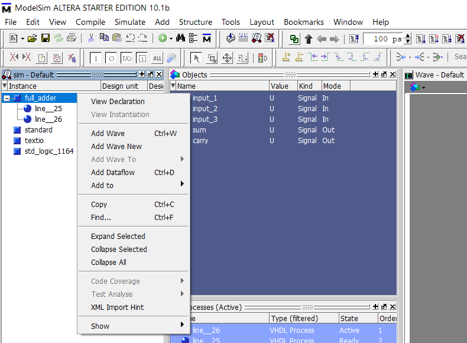
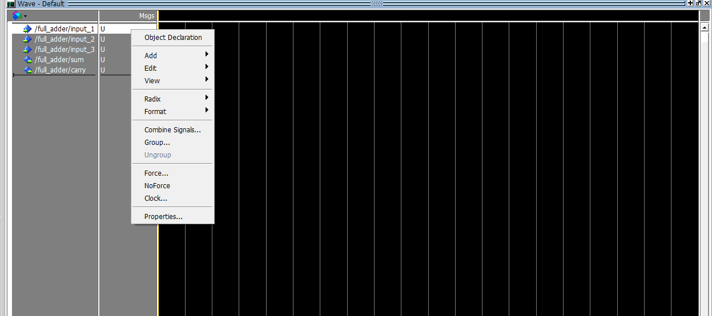
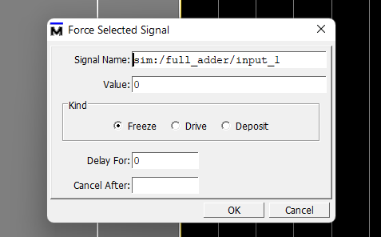

## FULL ADDER IN VHDL

The process of running the vhdl program is same for all the programs only thing thats different is the input providing procedure for each of the circuitary implementations. The guide for running the vhdl program is given at the readme of the main practical folder 

## PROCEDURE

Firstly run the program as it should be by creating the project file and then compiling the program. Then simulate the program then you will be welcomed with a screen as shown below

---

After this then right click on full_adder on the left side of the screen and add the wave

---

Then now the msgs part appears on the wave 

---

Now force the inputs as per your requirement 

---

Give the ALU signal lines which is of 3 bits that signify the procedure that is to be done in the ALU. The following table shows all the possibilities

| A    | B    | C    | S    | C    |
| ---- | ---- | ---- | ---- | ---- |
| 0    | 0    | 0    | 0    | 0    |
| 0    | 0    | 1    | 1    | 0    |
| 0    | 1    | 0    | 1    | 0    |
| 0    | 1    | 1    | 0    | 1    |
| 1    | 0    | 0    | 1    | 0    |
| 1    | 0    | 1    | 0    | 1    |
| 1    | 1    | 0    | 0    | 1    |
| 1    | 1    | 1    | 1    | 1    |

Now suppose we take the inputs as 001 for the 3 inputs available then

---

Now run the program to get the output

From this example we can see that we gave the outputs 0001 and 0010 and the selection line was 000 which indicates addition procedure so the output is justified as the sum which is 0011 so we performed the addition operation. Similarly we can do other operations by changing the selection line codes.

---

